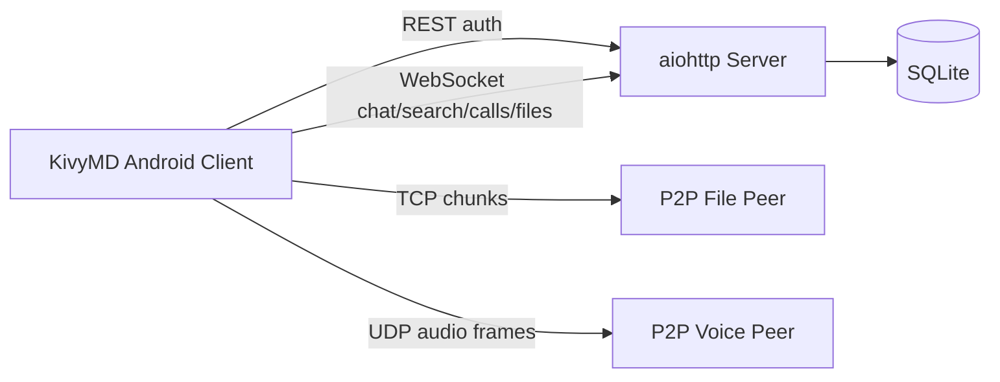

# Architecture

```mermaid
flowchart LR
  Client[KivyMD Android Client] -->|REST auth| Server[aiohttp Server]
  Client -->|WebSocket chat/search/calls/files| Server
  Server --> SQLite[(SQLite)]
  Client -->|TCP chunks| Peer[P2P File Peer]
  Client -->|UDP audio frames| Voice[P2P Voice Peer]
```

The server never receives private keys. Public keys can be stored on the server, while private keys are protected locally by password-derived encryption.
